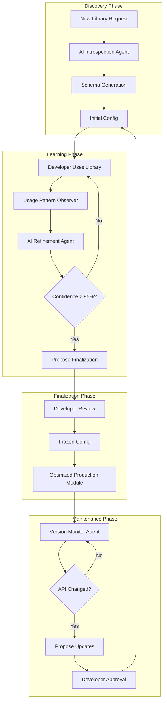

# AutoBridge: AI-Native Python Library Integration

<p align="center">
  <strong>🧠 The Library That Builds Itself</strong>
</p>

> **Vision**: A single, intelligent system that automatically integrates any stateless Python library into Elixir—learning and evolving through AI-driven discovery, interactive development, and continuous refinement.

---

## The Big Idea

AutoBridge is not just another library integration tool. It represents a **paradigm shift** in how software is built:

**Traditional Approach:**
```
Developer → Manually writes config → Tests → Deploys → Repeat for each library
```

**AutoBridge Approach:**
```
Developer → Uses library → AI observes patterns → Converges on optimal config → Zero ongoing maintenance
```

This is a **gateway to next-generation software architecture** where AI is native to the application, actively participating in building and maintaining itself.

---

## Core Philosophy

### 1. Stateless Python, Stateful BEAM

The BEAM (Erlang VM) excels at state management, concurrency, and fault tolerance. Python excels at computational libraries. AutoBridge embraces this division:

| Responsibility | Owner |
|---------------|-------|
| Symbolic computation | Python (SymPy) |
| LaTeX processing | Python (pylatexenc) |
| Mathematical verification | Python (Math-Verify) |
| Session management | BEAM (GenServer) |
| Caching | BEAM (ETS) |
| Fault tolerance | BEAM (Supervisors) |
| State & coordination | BEAM (Processes) |

### 2. AI-Driven Evolution, Not Static Configuration

Instead of hoping a community maintains adapters, AutoBridge uses **agentic AI systems** to:

- Discover library APIs automatically
- Generate optimal configurations through heuristics
- Learn from developer interactions during use
- Continuously refine and update adapters as libraries evolve

### 3. Interactive Convergence

The "magic" isn't deterministic heuristics that miss edge cases. It's an **AI-assisted process** that:

- Observes how developers use the library
- Proposes configuration refinements
- Learns from corrections and feedback
- Converges on a finalized "zero-config" state

---

## Target Libraries (Phase 1)

### Priority 1: Mathematical & Scientific

| Library | Purpose | Integration Focus |
|---------|---------|-------------------|
| **SymPy** | Symbolic mathematics | Core symbolic classes, solvers, simplifiers |
| **pylatexenc** | LaTeX ↔ Unicode conversion | Stateless conversion functions |
| **Math-Verify** | Mathematical expression evaluation | Parser, verifier, grader components |

### Why These Libraries?

1. **Stateless by nature** - Pure computational functions
2. **Well-documented APIs** - Clear introspection targets
3. **Complementary** - Together they form a complete math processing pipeline
4. **Real-world demand** - Essential for LLM evaluation, education tech, scientific computing

---

## Document Index

| Document | Purpose |
|----------|---------|
| [Architecture](./architecture.md) | System design and component overview |
| [Agentic System](./agentic-system.md) | How AI drives discovery and refinement |
| [Adapter Lifecycle](./adapter-lifecycle.md) | From discovery to zero-config finalization |
| [Interactive Development](./interactive-development.md) | Developer experience during library usage |
| [Priority Libraries](./priority-libraries.md) | SymPy, pylatexenc, Math-Verify specifications |
| [Implementation Roadmap](./implementation-roadmap.md) | Phased development plan |
| [Type Mapping](./type-mapping.md) | Python ↔ Elixir type conversion strategies |

---

## Quick Example: The Vision

```elixir
# DAY 1: First time using SymPy
# AutoBridge has never seen this library

iex> use AutoBridge, :sympy

# Behind the scenes:
# 1. AI discovers SymPy's API structure
# 2. Generates initial config with smart defaults
# 3. Creates type mappings for symbolic expressions
# 4. Starts in "learning mode"

iex> AutoBridge.SymPy.symbols("x y z")
{:ok, [x, y, z]}

# AutoBridge observes: "User called symbols() with string arg, got list back"
# AI updates internal model of common usage patterns

iex> AutoBridge.SymPy.solve("x**2 - 1", :x)
{:ok, [-1, 1]}

# More observations accumulate...
# AI notices: "solve() always used with expression string + symbol"
# Proposes refined typespec: solve(String.t(), atom()) :: {:ok, list()}

# INTERACTIVE REFINEMENT (in dev mode):

iex> AutoBridge.status(:sympy)
%{
  mode: :learning,
  confidence: 0.73,
  observations: 47,
  proposed_refinements: [
    {:typespec, :solve, "Add symbol constraint"},
    {:default, :simplify, "Auto-simplify results"}
  ],
  pending_review: 2
}

iex> AutoBridge.accept_refinement(:sympy, 0)
# ✓ Typespec updated for solve/2

# AFTER STABILIZATION (confidence > 0.95):

iex> AutoBridge.finalize(:sympy)
# Generates frozen config: priv/autobridge/adapters/sympy.exs
# Compiles optimized wrapper module
# Disables learning mode
# Library is now "zero-config" for all users
```

---

## What Makes This "Next-Gen"

### Traditional Integration Libraries
- Static configs maintained by humans
- Community contributions with varying quality
- Breaks when Python libraries update
- One-size-fits-all approach

### AutoBridge
- **Self-building**: AI generates and refines configs
- **Self-healing**: Detects API changes, proposes updates
- **Context-aware**: Learns from actual usage patterns
- **Converges**: Moves from "learning" to "frozen" state
- **Interactive**: Developer collaborates with AI during refinement

---

## The Agentic Pipeline



---

## Success Metrics

1. **Time to Integration**: < 5 minutes from "never seen library" to working wrapper
2. **Configuration Accuracy**: > 95% of generated configs work without modification
3. **Maintenance Burden**: Zero manual updates required for library version bumps
4. **Developer Experience**: Interactive refinement feels natural, not intrusive

---

## Getting Started

See [Implementation Roadmap](./implementation-roadmap.md) for the phased development plan.

---

*This design represents a prototype for AI-native software architecture—where the system actively participates in building and maintaining itself.*
