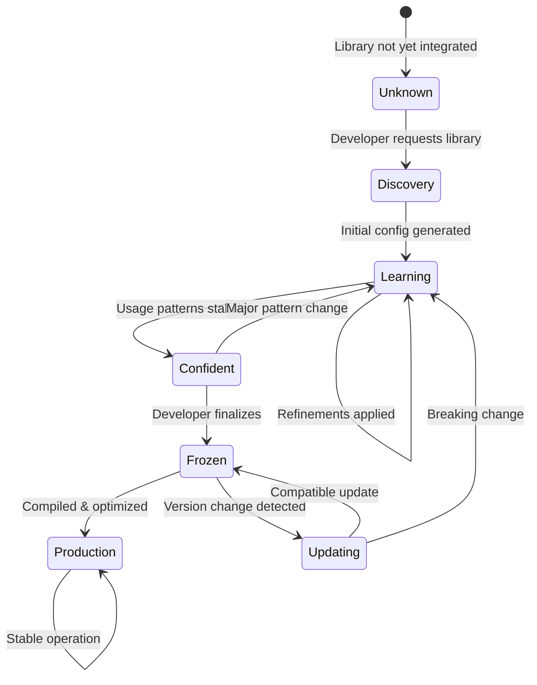
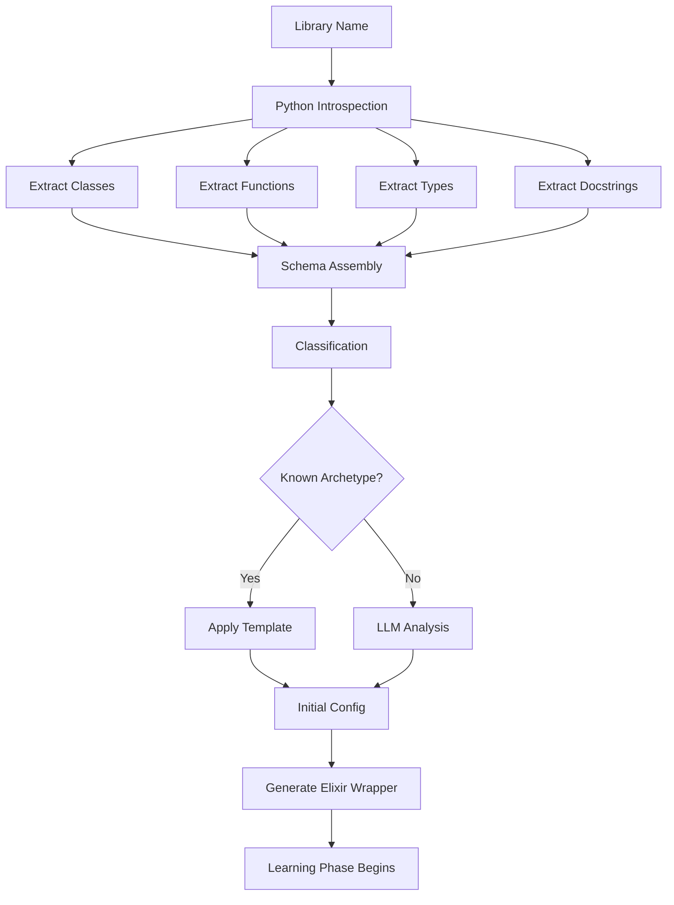
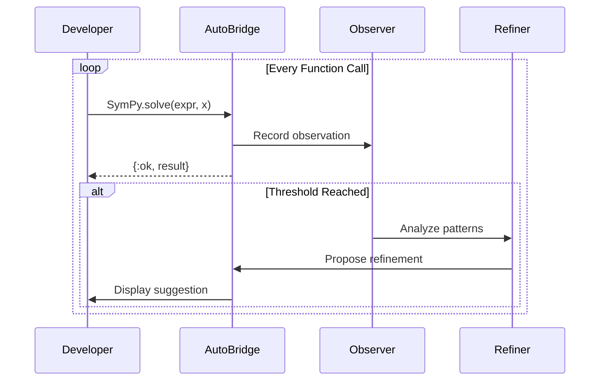
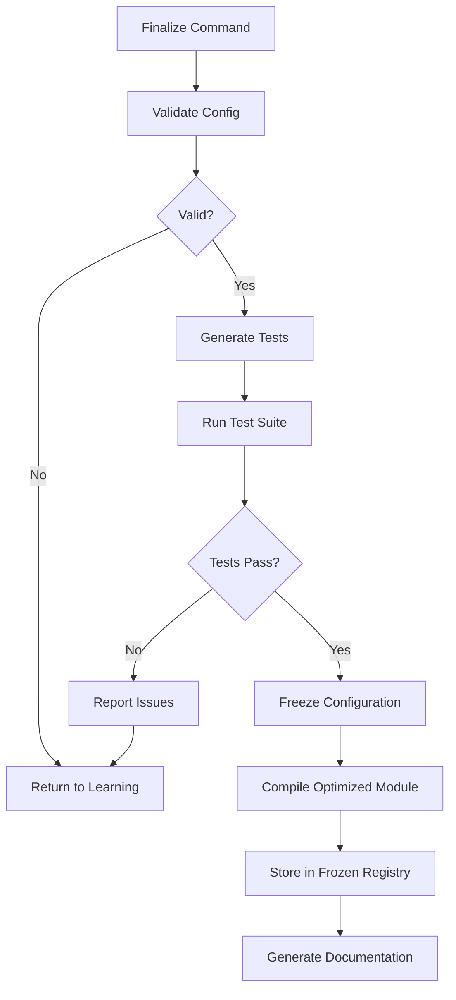
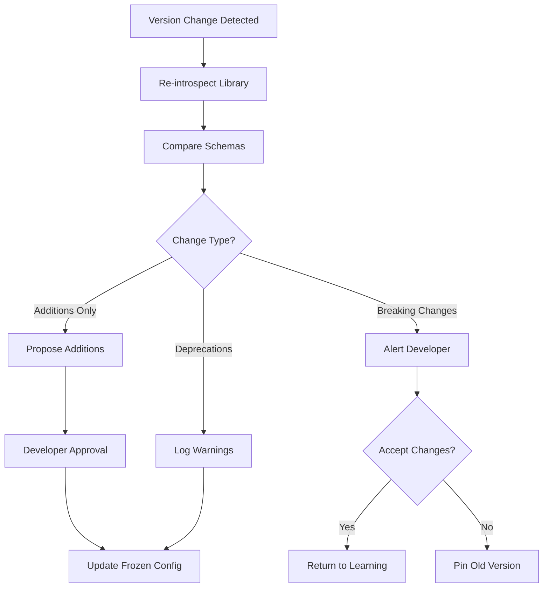

# Adapter Lifecycle

## Overview

Every Python library adapter in AutoBridge follows a defined lifecycle, transitioning from unknown to fully optimized production wrapper. This document details each phase, transitions, and the artifacts produced.

---

## Lifecycle Phases



---

## Phase 1: Unknown

**State**: Library has never been used with AutoBridge.

**Artifacts**: None

**Triggers to Next**: 
```elixir
use AutoBridge, :sympy
# OR
AutoBridge.integrate("sympy")
```

---

## Phase 2: Discovery

**State**: AI agents are analyzing the Python library.

**Duration**: 1-30 seconds (depending on library size)

**Process**:


**Artifacts Produced**:
```
priv/autobridge/learning/sympy/
├── schema.json           # Full Python introspection
├── classification.json   # Library category & archetype
├── initial_config.exs    # Generated configuration
└── wrapper.beam          # Runtime-compiled module
```

**Example Schema**:
```json
{
  "library": "sympy",
  "version": "1.13.1",
  "classification": "math_symbolic",
  "modules": [
    {
      "path": "sympy.core.symbol",
      "classes": [
        {
          "name": "Symbol",
          "bases": ["AtomicExpr"],
          "methods": [...],
          "constructor": {
            "args": ["name"],
            "kwargs": {"commutative": true}
          }
        }
      ],
      "functions": [
        {
          "name": "symbols",
          "signature": "(names, **kwargs) -> tuple",
          "docstring": "..."
        }
      ]
    }
  ]
}
```

**Transition**: Automatic to Learning phase once config is generated.

---

## Phase 3: Learning

**State**: Adapter is active, AI is observing usage patterns.

**Duration**: Variable (until confidence > 95% OR developer forces finalization)

**Signals**:
- Every function call is observed
- Type patterns are accumulated
- Error conditions are logged
- Performance is tracked

**Process**:


**Artifacts Updated**:
```
priv/autobridge/learning/sympy/
├── observations.dets     # Persistent observation store
├── patterns.json         # Detected usage patterns
├── refinements.json      # Proposed improvements
├── current_config.exs    # Updated configuration
└── confidence.json       # Confidence metrics
```

**Refinement Proposal Example**:
```json
{
  "id": "ref_001",
  "type": "typespec",
  "target": "solve/2",
  "status": "pending",
  "proposed_at": "2024-12-22T10:30:00Z",
  "current": "@spec solve(term(), term()) :: {:ok, term()} | {:error, term()}",
  "proposed": "@spec solve(expression(), symbol()) :: {:ok, [expression()]} | {:error, solve_error()}",
  "rationale": "Observed 47 calls: 100% string expressions, 100% atom symbols, 95% list results",
  "confidence": 0.92,
  "observations_supporting": 47
}
```

**Developer Interaction**:
```elixir
iex> AutoBridge.status(:sympy)
%{
  phase: :learning,
  confidence: 0.73,
  observations: 124,
  pending_refinements: 3,
  time_in_phase: "2 days, 4 hours"
}

iex> AutoBridge.pending_refinements(:sympy)
[
  %{id: "ref_001", type: :typespec, target: "solve/2", confidence: 0.92},
  %{id: "ref_002", type: :default, target: "simplify/2", confidence: 0.87},
  %{id: "ref_003", type: :docstring, target: "expand/1", confidence: 0.78}
]

iex> AutoBridge.accept("ref_001")
:ok  # Typespec updated

iex> AutoBridge.reject("ref_002", reason: "I prefer explicit options")
:ok  # Refinement dismissed, learning continues

iex> AutoBridge.modify("ref_003", docstring: "Custom docstring here")
:ok  # Developer-provided override
```

**Confidence Calculation**:
```elixir
defmodule AutoBridge.Confidence do
  def calculate(library) do
    weights = %{
      observation_count: 0.3,
      type_consistency: 0.25,
      error_rate: 0.15,
      refinement_stability: 0.2,
      coverage: 0.1
    }
    
    scores = %{
      observation_count: min(observations(library) / 100, 1.0),
      type_consistency: type_consistency_score(library),
      error_rate: 1.0 - error_rate(library),
      refinement_stability: refinement_stability(library),
      coverage: function_coverage(library)
    }
    
    Enum.reduce(weights, 0, fn {key, weight}, acc ->
      acc + (scores[key] * weight)
    end)
  end
end
```

**Transition**: 
- → Confident: When confidence > 0.95
- → Learning: Stays until threshold OR manual intervention

---

## Phase 4: Confident

**State**: AI believes the adapter is stable and ready for finalization.

**Duration**: Until developer action

**Automatic Prompt**:
```
╭─────────────────────────────────────────────────────────────╮
│ 🎯 AutoBridge: sympy ready for finalization                │
├─────────────────────────────────────────────────────────────┤
│ Confidence: 97.2%                                           │
│ Observations: 243                                           │
│ Refinements applied: 7                                      │
│ Functions covered: 23/28 (82%)                              │
│                                                             │
│ Run `AutoBridge.finalize(:sympy)` to:                       │
│ • Generate frozen configuration                             │
│ • Compile optimized wrapper                                 │
│ • Enable production mode                                    │
│                                                             │
│ Or continue using for more observations.                    │
╰─────────────────────────────────────────────────────────────╯
```

**Developer Options**:
```elixir
# Option 1: Finalize
AutoBridge.finalize(:sympy)

# Option 2: Continue learning with higher threshold
AutoBridge.configure(:sympy, confidence_threshold: 0.99)

# Option 3: Review before finalizing
AutoBridge.review(:sympy)  # Opens detailed report
```

**Transition**:
- → Frozen: `AutoBridge.finalize(:library)`
- → Learning: If usage patterns change significantly

---

## Phase 5: Frozen

**State**: Configuration is locked, adapter is production-ready.

**Process**:


**Artifacts Produced**:
```
priv/autobridge/frozen/sympy-1.13/
├── config.exs            # Frozen configuration
├── schema.json           # Locked schema reference
├── wrapper.ex            # Generated source (for reference)
├── wrapper.beam          # Compiled optimized module
├── types.ex              # Generated type definitions
├── tests.exs             # Auto-generated test suite
├── docs.md               # Generated documentation
└── metadata.json         # Version, timestamps, etc.
```

**Frozen Config Example**:
```elixir
# priv/autobridge/frozen/sympy-1.13/config.exs
%AutoBridge.FrozenConfig{
  library: "sympy",
  version: "1.13.1",
  frozen_at: ~U[2024-12-22 15:30:00Z],
  confidence_at_freeze: 0.972,
  
  elixir_module: AutoBridge.SymPy,
  
  functions: [
    %{
      name: :symbols,
      python_path: "sympy.symbols",
      spec: "@spec symbols(String.t(), keyword()) :: {:ok, [atom()]}",
      defaults: %{cls: :symbol, commutative: true}
    },
    %{
      name: :solve,
      python_path: "sympy.solve",
      spec: "@spec solve(String.t() | expression(), atom()) :: {:ok, [term()]}",
      docs: "Solves the given equation for the specified variable."
    },
    # ... more functions
  ],
  
  types: [
    {:expression, "String.t() | map()"},
    {:symbol, "atom()"},
    {:solve_error, "{:error, :no_solution | :invalid_expression}"}
  ],
  
  options: %{
    timeout: 30_000,
    pool_size: 4,
    telemetry: true
  }
}
```

**Test Generation**:
```elixir
# priv/autobridge/frozen/sympy-1.13/tests.exs
defmodule AutoBridge.SymPyTest do
  use ExUnit.Case, async: true
  
  # Tests generated from observed successful calls
  
  describe "symbols/1" do
    test "creates symbols from string" do
      assert {:ok, symbols} = AutoBridge.SymPy.symbols("x y z")
      assert length(symbols) == 3
    end
  end
  
  describe "solve/2" do
    test "solves simple equation" do
      assert {:ok, solutions} = AutoBridge.SymPy.solve("x**2 - 1", :x)
      assert Enum.sort(solutions) == [-1, 1]
    end
    
    test "returns error for invalid expression" do
      assert {:error, _} = AutoBridge.SymPy.solve("invalid(((", :x)
    end
  end
end
```

---

## Phase 6: Production

**State**: Optimized wrapper in active use.

**Characteristics**:
- No observation overhead
- Compile-time optimized
- Full type checking (Dialyzer)
- Comprehensive documentation

**Usage**:
```elixir
# In production code
defmodule MyApp.MathEngine do
  alias AutoBridge.SymPy
  
  def solve_equation(expr, var) do
    SymPy.solve(expr, var)
  end
end
```

---

## Phase 7: Updating (Maintenance)

**State**: Maintainer agent detected version or API change.

**Triggers**:
- Python library version update
- API breaking change detected
- Deprecation warnings

**Process**:


**Update Notification**:
```
╭─────────────────────────────────────────────────────────────╮
│ ⚠️  AutoBridge: sympy version change detected               │
├─────────────────────────────────────────────────────────────┤
│ Current adapter: sympy 1.13.1                              │
│ Installed version: sympy 1.14.0                            │
│                                                             │
│ Changes detected:                                           │
│ • [ADDITION] sympy.simplify.radsimp() - new function       │
│ • [ADDITION] sympy.core.expr.Expr.rewrite() - new method   │
│ • [DEPRECATION] sympy.utilities.lambdify() - use sympy.lambdify │
│                                                             │
│ No breaking changes detected.                               │
│                                                             │
│ [u]pdate adapter  [i]gnore  [r]evert to 1.13               │
╰─────────────────────────────────────────────────────────────╯
```

---

## Lifecycle Storage Locations

```
priv/autobridge/
│
├── learning/                  # Phase 3: Active learning
│   ├── sympy/
│   │   ├── schema.json
│   │   ├── observations.dets
│   │   ├── patterns.json
│   │   ├── refinements.json
│   │   └── current_config.exs
│   └── pylatexenc/
│       └── ...
│
├── frozen/                    # Phase 5-6: Production
│   ├── sympy-1.13/
│   │   ├── config.exs
│   │   ├── wrapper.beam
│   │   ├── tests.exs
│   │   └── docs.md
│   └── pylatexenc-3.0/
│       └── ...
│
├── bundled/                   # Ships with AutoBridge
│   ├── json.exs               # Built-in Python json
│   └── math.exs               # Built-in Python math
│
└── archive/                   # Old versions (for rollback)
    └── sympy-1.12/
        └── ...
```

---

## APIs for Lifecycle Management

```elixir
defmodule AutoBridge.Lifecycle do
  @doc "Get current phase of a library"
  def phase(library), do: ...
  
  @doc "Get detailed status"
  def status(library), do: ...
  
  @doc "Force transition (with safety checks)"
  def transition(library, to_phase), do: ...
  
  @doc "Reset to discovery phase"
  def reset(library), do: ...
  
  @doc "Export frozen config for sharing"
  def export(library, path), do: ...
  
  @doc "Import shared frozen config"
  def import(path), do: ...
  
  @doc "List all adapters by phase"
  def list_by_phase(phase), do: ...
end

# Usage Examples
AutoBridge.Lifecycle.phase(:sympy)
# => :learning

AutoBridge.Lifecycle.status(:sympy)
# => %{phase: :learning, confidence: 0.73, observations: 124, ...}

AutoBridge.Lifecycle.reset(:sympy)
# => :ok (clears all learning data, restarts discovery)

AutoBridge.Lifecycle.export(:sympy, "exports/sympy-adapter.zip")
# => :ok (creates portable adapter package)
```

---

## Best Practices

### For Rapid Finalization

1. **Focus usage on core functions** - Prioritize the functions you actually need
2. **Accept reasonable refinements** - Don't over-engineer early
3. **Use realistic data** - Pass real-world inputs during learning
4. **Review type proposals carefully** - Types are the most impactful refinements

### For Maximum Quality

1. **Let learning run longer** - More observations = better confidence
2. **Test edge cases** - Intentionally try unusual inputs
3. **Review generated tests** - Add custom tests if needed
4. **Document complex types** - Add custom type definitions

### For Team Sharing

1. **Export frozen adapters** - Share across team members
2. **Version lock Python libraries** - Consistent environments
3. **Include in version control** - `priv/autobridge/frozen/` should be committed
