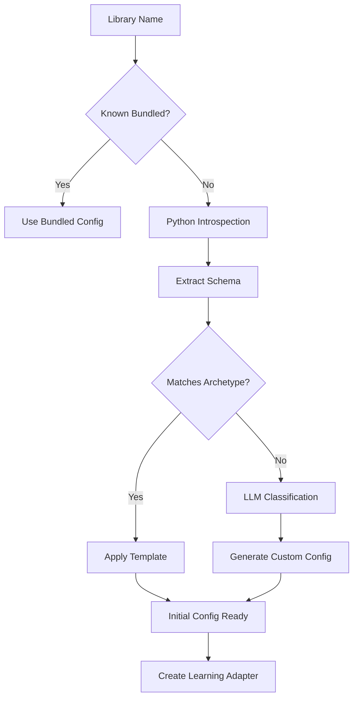
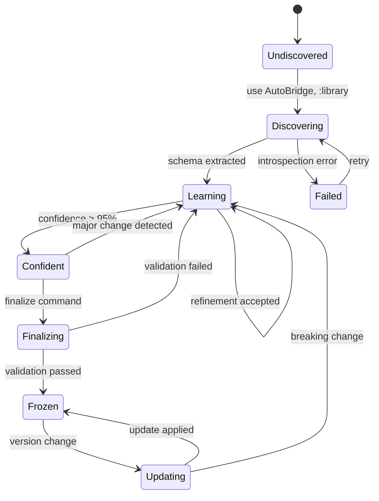
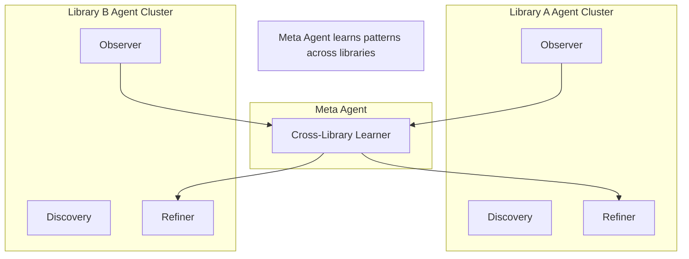

# AutoBridge Agentic System

## Overview

The AutoBridge agentic system is the "brain" that enables self-building, self-healing library integration. Unlike traditional static configuration systems, it uses AI agents that actively observe, learn, and propose improvements.

---

## Agent Architecture

```
┌────────────────────────────────────────────────────────────────────────┐
│                        AGENT ORCHESTRATOR                               │
│  ┌──────────────────────────────────────────────────────────────────┐  │
│  │                     Event Router & Scheduler                      │  │
│  └──────────────────────────────────────────────────────────────────┘  │
│         │              │              │               │                 │
│         ▼              ▼              ▼               ▼                 │
│  ┌───────────┐  ┌───────────┐  ┌───────────┐  ┌────────────┐          │
│  │ Discovery │  │ Observer  │  │  Refiner  │  │ Maintainer │          │
│  │   Agent   │  │   Agent   │  │   Agent   │  │   Agent    │          │
│  └───────────┘  └───────────┘  └───────────┘  └────────────┘          │
│       │              │              │               │                   │
│       │         ┌────┴────┐    ┌────┴────┐         │                   │
│       │         │ Pattern │    │   LLM   │         │                   │
│       │         │ Matcher │    │ Backend │         │                   │
│       │         └─────────┘    └─────────┘         │                   │
└───────┼──────────────────────────────────────────────┼─────────────────┘
        │                                              │
        ▼                                              ▼
   ┌─────────┐                                   ┌──────────┐
   │ Python  │                                   │  PyPI /  │
   │ Runtime │                                   │ Versions │
   └─────────┘                                   └──────────┘
```

---

## The Four Agents

### 1. Discovery Agent

**Purpose**: Transform unknown Python libraries into usable Elixir wrappers.

**Capabilities**:
- Deep Python introspection (classes, functions, signatures, docstrings)
- Library classification (math, text, ML, data, web, etc.)
- Archetype matching (known patterns → config templates)
- Initial type mapping inference

**AI Integration**:
```elixir
defmodule AutoBridge.Agents.Discovery do
  @doc """
  The Discovery Agent uses a combination of heuristics and LLM
  for smart library analysis.
  """
  
  # Heuristic layer (fast, deterministic)
  defp classify_by_structure(schema) do
    cond do
      has_symbolic_types?(schema) -> :math_symbolic
      has_tensor_types?(schema) -> :ml_framework
      has_parser_patterns?(schema) -> :text_processing
      has_http_patterns?(schema) -> :web_client
      true -> :generic
    end
  end
  
  # LLM layer (smart, for edge cases)
  defp classify_with_llm(schema) do
    prompt = """
    Analyze this Python library schema and classify it:
    
    #{format_schema(schema)}
    
    Categories: math_symbolic, text_processing, ml_framework, 
                data_processing, web_client, generic
    
    Also identify:
    1. Primary use case
    2. Key exports to wrap
    3. Stateful vs stateless nature
    4. Recommended Elixir module structure
    """
    
    LLMBackend.complete(prompt)
  end
  
  # Combine approaches
  def classify(schema) do
    heuristic = classify_by_structure(schema)
    
    if heuristic == :generic do
      # Fall back to LLM for unknown patterns
      classify_with_llm(schema)
    else
      {:ok, heuristic}
    end
  end
end
```

**Discovery Process**:



---

### 2. Observer Agent

**Purpose**: Watch library usage at runtime and collect learning data.

**What It Observes**:
- Function calls (name, arguments, results)
- Argument types and patterns
- Return value types
- Error conditions
- Performance characteristics
- Usage frequency

**Data Collection**:
```elixir
defmodule AutoBridge.Agents.Observer do
  @observation_fields [
    :function_name,
    :module_path,
    :argument_types,
    :argument_values_sample,  # Anonymized samples
    :result_type,
    :result_shape,            # For collections/tensors
    :success,
    :error_type,
    :duration_microseconds,
    :timestamp
  ]
  
  def observe_call(library, function, args, result, metadata) do
    observation = %Observation{
      function_name: function,
      module_path: metadata.module,
      argument_types: Enum.map(args, &type_of/1),
      argument_values_sample: sample_values(args),
      result_type: type_of(result),
      result_shape: shape_of(result),
      success: success?(result),
      error_type: error_type(result),
      duration_microseconds: metadata.duration,
      timestamp: System.monotonic_time(:microsecond)
    }
    
    store_observation(library, observation)
  end
  
  defp type_of(value) do
    cond do
      is_binary(value) -> :string
      is_integer(value) -> :integer
      is_float(value) -> :float
      is_list(value) -> {:list, type_of(hd(value))}
      is_map(value) -> :map
      is_atom(value) -> :atom
      true -> :unknown
    end
  end
end
```

**Pattern Detection**:
```elixir
defmodule AutoBridge.Agents.Observer.PatternDetector do
  @doc """
  Analyzes accumulated observations to detect usage patterns.
  """
  
  def detect_patterns(observations) do
    [
      detect_type_patterns(observations),
      detect_argument_patterns(observations),
      detect_error_patterns(observations),
      detect_performance_patterns(observations)
    ]
    |> List.flatten()
    |> Enum.filter(&significant?/1)
  end
  
  defp detect_type_patterns(observations) do
    observations
    |> Enum.group_by(& &1.function_name)
    |> Enum.map(fn {func, obs} ->
      arg_types = obs |> Enum.map(& &1.argument_types) |> find_common_types()
      result_type = obs |> Enum.map(& &1.result_type) |> find_common_type()
      
      %TypePattern{
        function: func,
        argument_types: arg_types,
        result_type: result_type,
        confidence: calculate_confidence(obs)
      }
    end)
  end
  
  defp detect_argument_patterns(observations) do
    # Find common argument values that could become defaults
    # e.g., "most calls to solve() pass simplify: true"
  end
  
  defp detect_error_patterns(observations) do
    # Find common error conditions
    # e.g., "TypeError when passing integer to string arg"
  end
end
```

---

### 3. Refiner Agent

**Purpose**: Transform observations into actionable configuration improvements.

**Refinement Types**:

| Type | Description | Example |
|------|-------------|---------|
| `typespec` | Type specification updates | `@spec solve(String.t())` → `@spec solve(expression())` |
| `default` | Add default argument values | `simplify \\ true` |
| `validation` | Input validation rules | `guard is_binary(expr)` |
| `docstring` | Documentation generation | Auto-generated from usage |
| `error_handling` | Error mapping | Python exceptions → Elixir errors |
| `alias` | Function aliases | `simplify/1` also as `simp/1` |

**LLM-Powered Refinement**:
```elixir
defmodule AutoBridge.Agents.Refiner do
  @doc """
  Uses LLM to generate intelligent refinement proposals.
  """
  
  def propose_refinements(library, patterns) do
    # First, use heuristics for obvious refinements
    heuristic_refinements = patterns
    |> Enum.flat_map(&apply_heuristics/1)
    
    # Then, use LLM for nuanced suggestions
    llm_refinements = generate_llm_refinements(library, patterns)
    
    # Combine and deduplicate
    (heuristic_refinements ++ llm_refinements)
    |> Enum.uniq_by(& &1.target)
    |> Enum.sort_by(& &1.confidence, :desc)
  end
  
  defp generate_llm_refinements(library, patterns) do
    prompt = """
    I'm building an Elixir wrapper for the Python library "#{library}".
    
    Based on these observed usage patterns:
    #{format_patterns(patterns)}
    
    Current configuration:
    #{format_current_config(library)}
    
    Suggest improvements for:
    1. Type specifications (be specific about Elixir types)
    2. Default argument values
    3. Error handling strategies
    4. Documentation
    5. Any idiomatic Elixir patterns we should apply
    
    Format each suggestion as:
    - Type: [typespec|default|validation|docstring|error_handling]
    - Target: [function name]
    - Current: [current behavior]
    - Proposed: [proposed change]
    - Rationale: [why this helps]
    """
    
    response = LLMBackend.complete(prompt)
    parse_refinement_suggestions(response)
  end
end
```

**Confidence Scoring**:
```elixir
defmodule AutoBridge.Agents.Refiner.Confidence do
  @doc """
  Calculates confidence score for refinement proposals.
  
  Factors:
  - Number of supporting observations
  - Consistency of patterns
  - Type of refinement
  - Library maturity signals
  """
  
  def score(refinement, observations) do
    base_score = observation_support_score(refinement, observations)
    consistency = pattern_consistency_score(refinement, observations)
    type_weight = refinement_type_weight(refinement.type)
    
    # Weighted combination
    (base_score * 0.5 + consistency * 0.3) * type_weight
  end
  
  defp observation_support_score(refinement, observations) do
    relevant = Enum.filter(observations, &relevant?(&1, refinement))
    min(length(relevant) / 50, 1.0)  # Cap at 50 observations
  end
  
  defp pattern_consistency_score(refinement, observations) do
    # How consistent are the observations?
    # e.g., 95% of calls return string → high consistency
  end
  
  defp refinement_type_weight(type) do
    case type do
      :typespec -> 1.0       # High confidence needed
      :default -> 0.9        # Medium-high
      :docstring -> 0.7      # Lower bar
      :validation -> 1.0     # High confidence needed
      _ -> 0.8
    end
  end
end
```

---

### 4. Maintainer Agent

**Purpose**: Keep adapters healthy over time as Python libraries evolve.

**Responsibilities**:
- Monitor library version updates
- Detect API changes
- Propose adapter updates
- Track deprecations

**Version Monitoring**:
```elixir
defmodule AutoBridge.Agents.Maintainer do
  use GenServer
  
  @check_interval :timer.hours(24)
  
  def handle_info(:version_check, state) do
    for {library, adapter} <- list_frozen_adapters() do
      current_version = get_installed_version(library)
      adapter_version = adapter.version_constraint
      
      cond do
        version_mismatch?(current_version, adapter_version) ->
          check_api_compatibility(library, adapter)
          
        newer_available?(library, current_version) ->
          notify_update_available(library, current_version)
          
        true ->
          :ok
      end
    end
    
    schedule_check(@check_interval)
    {:noreply, state}
  end
  
  defp check_api_compatibility(library, adapter) do
    # Re-introspect the library
    {:ok, current_schema} = AutoBridge.Agents.Discovery.introspect(library)
    
    # Compare with adapter's expected schema
    changes = diff_schemas(adapter.schema, current_schema)
    
    case categorize_changes(changes) do
      :compatible ->
        :ok
        
      {:additions, new_funcs} ->
        propose_additions(library, new_funcs)
        
      {:breaking, broken_funcs} ->
        alert_breaking_changes(library, broken_funcs)
        
      {:deprecations, deprecated} ->
        log_deprecations(library, deprecated)
    end
  end
end
```

---

## LLM Backend Integration

AutoBridge supports multiple LLM backends for AI operations:

```elixir
defmodule AutoBridge.LLMBackend do
  @moduledoc """
  Abstraction layer for LLM operations.
  
  Supports:
  - Local models (Ollama, llama.cpp)
  - OpenAI API
  - Anthropic API
  - Custom endpoints
  """
  
  @callback complete(prompt :: String.t(), opts :: keyword()) :: {:ok, String.t()} | {:error, term()}
  @callback embed(text :: String.t()) :: {:ok, [float()]} | {:error, term()}
  
  def complete(prompt, opts \\ []) do
    backend = get_configured_backend()
    backend.complete(prompt, opts)
  end
  
  # Implementations
  defmodule Ollama do
    @behaviour AutoBridge.LLMBackend
    
    def complete(prompt, opts) do
      model = Keyword.get(opts, :model, "codellama")
      # Call local Ollama instance
    end
  end
  
  defmodule OpenAI do
    @behaviour AutoBridge.LLMBackend
    
    def complete(prompt, opts) do
      model = Keyword.get(opts, :model, "gpt-4")
      # Call OpenAI API
    end
  end
end
```

**Configuration**:
```elixir
# config/config.exs
config :autobridge,
  llm_backend: AutoBridge.LLMBackend.Ollama,
  llm_model: "codellama:13b",
  llm_temperature: 0.3,  # Lower for more deterministic
  
  # OR for cloud
  llm_backend: AutoBridge.LLMBackend.OpenAI,
  llm_api_key: System.get_env("OPENAI_API_KEY")
```

---

## Event System

Agents communicate through a central event bus:

```elixir
defmodule AutoBridge.Events do
  @moduledoc """
  Event system for agent coordination.
  """
  
  @events [
    # Discovery events
    :library_discovered,
    :schema_extracted,
    :config_generated,
    
    # Observation events
    :function_called,
    :error_occurred,
    :pattern_detected,
    
    # Refinement events
    :refinement_proposed,
    :refinement_accepted,
    :refinement_rejected,
    
    # Maintenance events
    :version_changed,
    :api_changed,
    :deprecation_detected,
    
    # Lifecycle events
    :learning_started,
    :confidence_threshold_reached,
    :adapter_finalized
  ]
  
  def emit(event, payload) do
    Phoenix.PubSub.broadcast(AutoBridge.PubSub, "agents", {event, payload})
  end
  
  def subscribe do
    Phoenix.PubSub.subscribe(AutoBridge.PubSub, "agents")
  end
end
```

---

## Learning State Machine

Each library adapter follows a state machine:



**State Storage**:
```elixir
defmodule AutoBridge.AdapterState do
  defstruct [
    :library,
    :state,           # :undiscovered, :discovering, :learning, etc.
    :schema,
    :config,
    :observations,
    :patterns,
    :refinements,
    :confidence,
    :version,
    :created_at,
    :updated_at
  ]
  
  def transition(adapter, event) do
    case {adapter.state, event} do
      {:undiscovered, :discover} -> {:discovering, start_discovery(adapter)}
      {:discovering, {:schema, schema}} -> {:learning, init_learning(adapter, schema)}
      {:learning, {:observation, obs}} -> {:learning, add_observation(adapter, obs)}
      {:learning, {:confidence, c}} when c > 0.95 -> {:confident, adapter}
      {:confident, :finalize} -> {:finalizing, start_finalization(adapter)}
      {:finalizing, :validated} -> {:frozen, freeze(adapter)}
      _ -> {:error, :invalid_transition}
    end
  end
end
```

---

## Observability

### Telemetry Events

```elixir
# All agent actions emit telemetry
:telemetry.execute(
  [:autobridge, :agent, :discovery, :complete],
  %{duration: duration},
  %{library: library, functions_found: count}
)

:telemetry.execute(
  [:autobridge, :agent, :observer, :pattern_detected],
  %{count: 1},
  %{library: library, pattern_type: type}
)

:telemetry.execute(
  [:autobridge, :agent, :refiner, :proposal],
  %{confidence: confidence},
  %{library: library, refinement_type: type}
)
```

### Metrics Dashboard

```elixir
defmodule AutoBridge.Metrics do
  def library_status(library) do
    %{
      state: get_state(library),
      confidence: get_confidence(library),
      observations: count_observations(library),
      pending_refinements: count_pending(library),
      last_activity: get_last_activity(library),
      time_in_learning: calculate_learning_time(library)
    }
  end
  
  def system_health do
    %{
      active_learnings: count_learning_adapters(),
      frozen_adapters: count_frozen_adapters(),
      pending_updates: count_pending_updates(),
      llm_quota_remaining: get_llm_quota(),
      agent_health: check_agent_health()
    }
  end
end
```

---

## Privacy & Safety

### Data Handling

```elixir
defmodule AutoBridge.Privacy do
  @doc """
  All observation data is processed locally by default.
  No external transmission without explicit consent.
  """
  
  # Argument values are sampled and anonymized
  def anonymize_sample(value) when is_binary(value) do
    cond do
      looks_like_api_key?(value) -> "[REDACTED]"
      String.length(value) > 100 -> String.slice(value, 0, 50) <> "..."
      true -> value
    end
  end
  
  def looks_like_api_key?(value) do
    # Detect common API key patterns
    String.match?(value, ~r/^(sk-|pk_|api_|key_)/)
  end
end
```

### AI Safety

```elixir
defmodule AutoBridge.Safety do
  @doc """
  All AI-generated code goes through safety checks.
  """
  
  def validate_generated_code(code) do
    checks = [
      &no_system_calls?/1,
      &no_file_writes?/1,
      &no_network_calls?/1,
      &valid_elixir_syntax?/1,
      &no_code_injection?/1
    ]
    
    Enum.all?(checks, & &1.(code))
  end
  
  defp no_system_calls?(code) do
    not String.contains?(code, ["System.cmd", "Port.open", ":os.cmd"])
  end
end
```

---

## Future: Multi-Agent Collaboration

Vision for advanced scenarios:



The Meta Agent could:
- Learn that "math libraries usually need Expr type handling"
- Apply lessons from SymPy to other symbolic math libraries
- Detect common Python patterns and pre-generate templates
