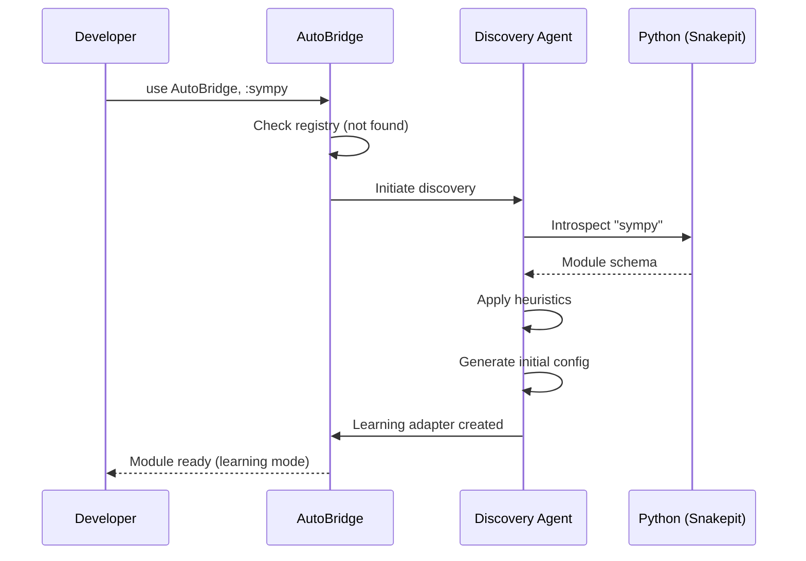
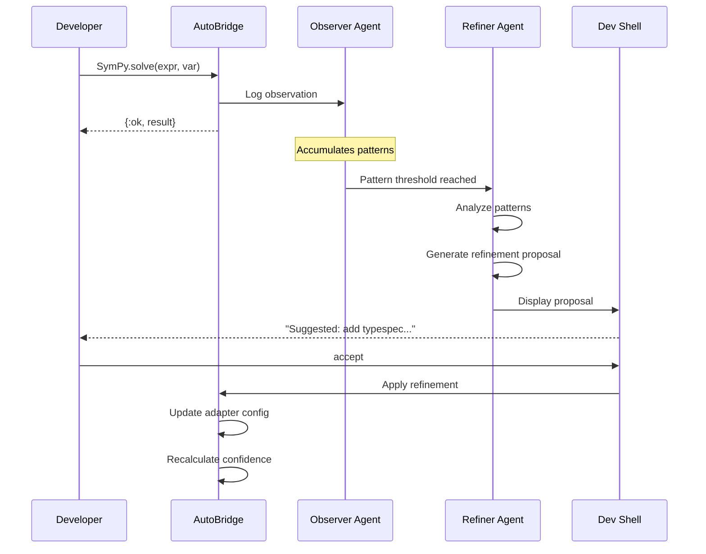
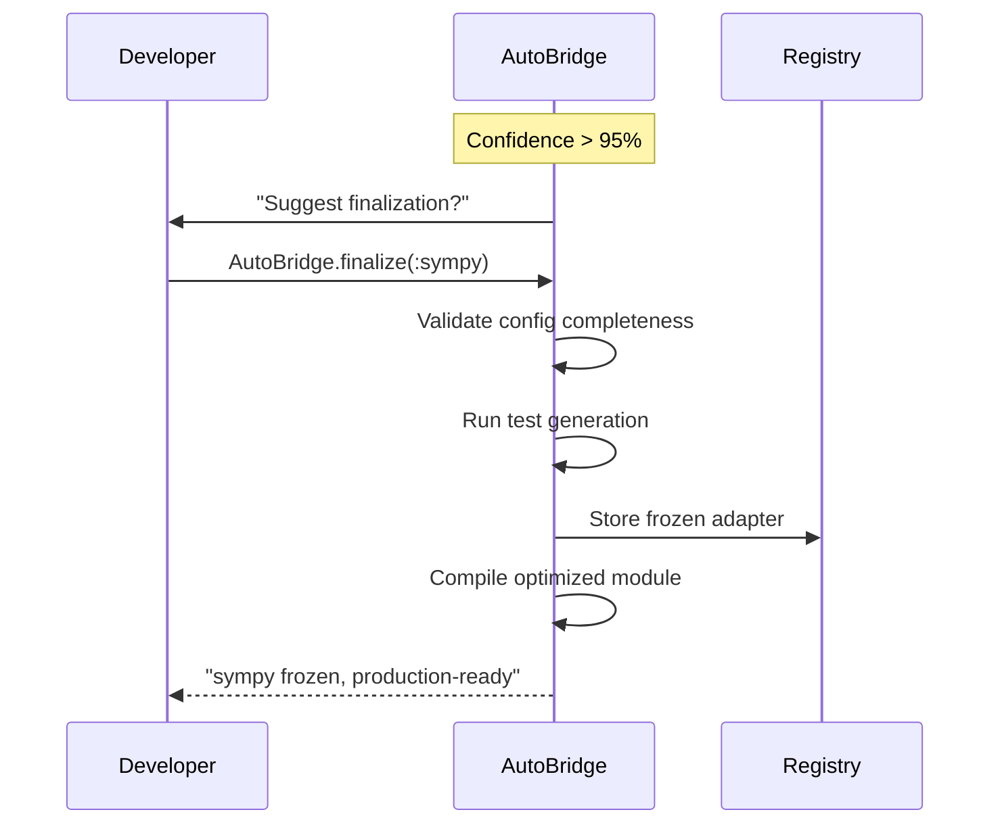

# AutoBridge Architecture

## System Overview

AutoBridge extends SnakeBridge with an intelligent layer that automates library integration through AI-driven discovery, observation, and refinement.

```
┌─────────────────────────────────────────────────────────────────────────────┐
│                           AUTOBRIDGE SYSTEM                                  │
├─────────────────────────────────────────────────────────────────────────────┤
│                                                                              │
│  ┌─────────────────────────────────────────────────────────────────────┐   │
│  │                    7. AGENTIC ORCHESTRATOR                           │   │
│  │  ┌─────────────┐  ┌──────────────┐  ┌─────────────┐  ┌───────────┐  │   │
│  │  │  Discovery  │  │   Learning   │  │ Refinement  │  │ Mainten.  │  │   │
│  │  │    Agent    │  │   Observer   │  │    Agent    │  │  Monitor  │  │   │
│  │  └─────────────┘  └──────────────┘  └─────────────┘  └───────────┘  │   │
│  └─────────────────────────────────────────────────────────────────────┘   │
│                                    ▲                                        │
│                                    │ Events                                 │
│                                    ▼                                        │
│  ┌─────────────────────────────────────────────────────────────────────┐   │
│  │                    6. INTERACTIVE DEV SHELL                          │   │
│  │  • Real-time refinement proposals  • Accept/reject UI                │   │
│  │  • Confidence metrics display      • Finalization workflow           │   │
│  └─────────────────────────────────────────────────────────────────────┘   │
│                                    ▲                                        │
│                                    │                                        │
│  ┌─────────────────────────────────┴───────────────────────────────────┐   │
│  │                    5. ADAPTER REGISTRY                               │   │
│  │  ┌──────────────┐  ┌──────────────┐  ┌──────────────┐               │   │
│  │  │   Learning   │  │   Frozen     │  │   Bundled    │               │   │
│  │  │   Adapters   │  │   Adapters   │  │   Adapters   │               │   │
│  │  │  (per-user)  │  │  (finalized) │  │ (with lib)   │               │   │
│  │  └──────────────┘  └──────────────┘  └──────────────┘               │   │
│  └─────────────────────────────────────────────────────────────────────┘   │
│                                    ▲                                        │
│                                    │                                        │
├────────────────────────────────────┼────────────────────────────────────────┤
│                     SNAKEBRIDGE CORE (Existing)                             │
│                                    │                                        │
│  ┌─────────────────────────────────┴───────────────────────────────────┐   │
│  │                    4. CODE GENERATION ENGINE                         │   │
│  └─────────────────────────────────────────────────────────────────────┘   │
│  ┌─────────────────────────────────────────────────────────────────────┐   │
│  │                    3. SCHEMA & TYPE SYSTEM                           │   │
│  └─────────────────────────────────────────────────────────────────────┘   │
│  ┌─────────────────────────────────────────────────────────────────────┐   │
│  │                    2. DISCOVERY & INTROSPECTION                      │   │
│  └─────────────────────────────────────────────────────────────────────┘   │
│  ┌─────────────────────────────────────────────────────────────────────┐   │
│  │                    1. EXECUTION RUNTIME (Snakepit)                   │   │
│  └─────────────────────────────────────────────────────────────────────┘   │
│                                                                              │
└─────────────────────────────────────────────────────────────────────────────┘
```

---

## Layer Descriptions

### Layer 1-4: SnakeBridge Core (Existing)

These layers remain unchanged from SnakeBridge:

| Layer | Purpose |
|-------|---------|
| **1. Execution Runtime** | Snakepit-based Python orchestration, gRPC, sessions |
| **2. Discovery** | Python introspection, schema extraction |
| **3. Schema & Types** | Type mapping, caching, inference |
| **4. Code Generation** | Macro-based Elixir module generation |

### Layer 5: Adapter Registry (New)

Manages three tiers of adapters:

```elixir
defmodule AutoBridge.AdapterRegistry do
  @moduledoc """
  Central registry for all Python library adapters.
  
  Adapter Tiers:
  - :learning  - Active observation, per-user, mutable
  - :frozen    - Finalized, shared, immutable
  - :bundled   - Ships with AutoBridge or Python library
  """
  
  defstruct [
    :library_name,
    :tier,
    :config,
    :confidence,
    :observations,
    :last_updated,
    :version_constraints
  ]
  
  # Resolution order: bundled > frozen > learning > generate_new
  def resolve(library_name) do
    case lookup_bundled(library_name) do
      {:ok, adapter} -> {:bundled, adapter}
      :not_found ->
        case lookup_frozen(library_name) do
          {:ok, adapter} -> {:frozen, adapter}
          :not_found ->
            case lookup_learning(library_name) do
              {:ok, adapter} -> {:learning, adapter}
              :not_found -> {:generate, library_name}
            end
        end
    end
  end
end
```

**Adapter Storage Locations:**

```
priv/autobridge/
├── bundled/           # Ships with AutoBridge (sympy.exs, etc.)
├── frozen/            # User-finalized adapters
│   ├── sympy-1.13.exs
│   └── numpy-2.0.exs
└── learning/          # Active learning state
    └── custom_lib.state
```

### Layer 6: Interactive Dev Shell (New)

Integrates with IEx to provide real-time feedback during development:

```elixir
defmodule AutoBridge.DevShell do
  @moduledoc """
  IEx integration for interactive adapter refinement.
  """
  
  def install do
    # Hooks into IEx.pry for observation
    # Displays refinement proposals in shell
    # Provides commands: AutoBridge.accept/2, AutoBridge.reject/2, etc.
  end
  
  def display_status(library) do
    # Shows current learning state, confidence, pending proposals
  end
  
  def propose_refinement(library, refinement) do
    # AI-generated suggestion displayed to developer
    # Developer can accept, reject, or modify
  end
end
```

**Example Shell Session:**

```
iex> AutoBridge.SymPy.expand("(x+1)**3")
{:ok, "x**3 + 3*x**2 + 3*x + 1"}

╭─────────────────────────────────────────────────────────────╮
│ 🧠 AutoBridge Suggestion                                    │
├─────────────────────────────────────────────────────────────┤
│ Library: sympy (learning mode, 67% confident)              │
│                                                             │
│ Observation: expand/1 always returns string expression     │
│                                                             │
│ Proposed refinement:                                        │
│   @spec expand(String.t()) :: {:ok, String.t()}            │
│                                                             │
│ [a]ccept  [r]eject  [m]odify  [i]gnore                     │
╰─────────────────────────────────────────────────────────────╯
```

### Layer 7: Agentic Orchestrator (New)

The brain of AutoBridge—coordinates AI agents for discovery, observation, and refinement.

```elixir
defmodule AutoBridge.AgenticOrchestrator do
  use GenServer
  
  @agents [
    AutoBridge.Agents.Discovery,      # Initial library introspection
    AutoBridge.Agents.Observer,       # Runtime usage pattern detection
    AutoBridge.Agents.Refiner,        # Configuration improvement proposals
    AutoBridge.Agents.Maintainer      # Version monitoring, update detection
  ]
  
  def start_link(opts) do
    GenServer.start_link(__MODULE__, opts, name: __MODULE__)
  end
  
  def init(_opts) do
    state = %{
      active_learnings: %{},
      agent_states: initialize_agents(@agents),
      event_queue: :queue.new()
    }
    {:ok, state}
  end
  
  # Events from library usage flow here
  def handle_cast({:observation, library, event}, state) do
    # Route to Observer agent
    # Accumulate patterns
    # Trigger Refiner when threshold reached
    {:noreply, process_observation(state, library, event)}
  end
end
```

---

## Data Flow

### Discovery Flow



### Learning Flow



### Finalization Flow



---

## Component Deep Dive

### Discovery Agent

Responsible for initial library analysis:

```elixir
defmodule AutoBridge.Agents.Discovery do
  @moduledoc """
  AI agent for Python library discovery and initial config generation.
  """
  
  defstruct [:library, :schema, :heuristics_applied, :initial_config]
  
  @doc """
  Discovers a Python library and generates initial configuration.
  
  Process:
  1. Deep introspection via Snakepit
  2. Classification (math, text, ML, data, etc.)
  3. Pattern matching against known library archetypes
  4. Heuristic-based config generation
  5. Initial type mapping
  """
  def discover(library_name) do
    with {:ok, schema} <- introspect(library_name),
         {:ok, classification} <- classify(schema),
         {:ok, archetype} <- match_archetype(classification),
         {:ok, config} <- generate_config(schema, archetype) do
      {:ok, %__MODULE__{
        library: library_name,
        schema: schema,
        heuristics_applied: archetype.heuristics,
        initial_config: config
      }}
    end
  end
  
  defp classify(schema) do
    # AI/heuristic classification
    # Returns: :math_symbolic, :text_processing, :ml_framework, etc.
  end
  
  defp match_archetype(classification) do
    # Match to predefined archetypes with config templates
  end
end
```

### Observer Agent

Watches library usage at runtime:

```elixir
defmodule AutoBridge.Agents.Observer do
  @moduledoc """
  Observes library usage patterns and accumulates learning data.
  """
  
  use GenServer
  
  defstruct [
    :library,
    :observations,
    :pattern_counts,
    :type_evidence,
    :error_patterns
  ]
  
  @doc """
  Records a function call observation.
  """
  def observe(library, function, args, result, duration) do
    observation = %{
      function: function,
      arg_types: infer_types(args),
      result_type: infer_type(result),
      success: match?({:ok, _}, result),
      duration_us: duration,
      timestamp: System.monotonic_time()
    }
    
    GenServer.cast(__MODULE__, {:observe, library, observation})
  end
  
  def handle_cast({:observe, library, obs}, state) do
    new_state = state
    |> update_pattern_counts(library, obs)
    |> update_type_evidence(library, obs)
    |> maybe_trigger_refinement(library)
    
    {:noreply, new_state}
  end
  
  defp maybe_trigger_refinement(state, library) do
    if observation_threshold_reached?(state, library) do
      AutoBridge.Agents.Refiner.analyze(library, state.observations[library])
    end
    state
  end
end
```

### Refiner Agent

Proposes configuration improvements:

```elixir
defmodule AutoBridge.Agents.Refiner do
  @moduledoc """
  Analyzes observations and proposes configuration refinements.
  
  This agent uses AI/LLM to generate intelligent refinement proposals
  based on accumulated usage patterns.
  """
  
  @refinement_types [
    :typespec,           # Update type specifications
    :default_value,      # Add sensible defaults
    :error_handling,     # Improve error handling
    :doc_string,         # Generate documentation
    :validation,         # Add input validation
    :optimization        # Performance hints
  ]
  
  def analyze(library, observations) do
    patterns = extract_patterns(observations)
    
    refinements = for type <- @refinement_types,
                      refinement = propose(type, patterns),
                      refinement != nil do
      refinement
    end
    
    # Send to DevShell for developer review
    AutoBridge.DevShell.propose_refinements(library, refinements)
  end
  
  defp propose(:typespec, patterns) do
    # Analyze type evidence to propose better typespecs
    # Uses statistical analysis of observed types
  end
  
  defp propose(:default_value, patterns) do
    # Identify commonly used argument values
    # Propose as defaults
  end
end
```

### Maintainer Agent

Monitors library versions and API changes:

```elixir
defmodule AutoBridge.Agents.Maintainer do
  @moduledoc """
  Background agent that monitors Python library versions
  and detects API changes that require adapter updates.
  """
  
  use GenServer
  
  @check_interval :timer.hours(24)
  
  def init(state) do
    schedule_check()
    {:ok, state}
  end
  
  def handle_info(:check_versions, state) do
    for {library, adapter} <- frozen_adapters() do
      case check_compatibility(library, adapter) do
        :compatible -> 
          :ok
        {:incompatible, changes} -> 
          notify_and_propose_update(library, changes)
        {:new_version, version} ->
          log_new_version(library, version)
      end
    end
    
    schedule_check()
    {:noreply, state}
  end
  
  defp check_compatibility(library, adapter) do
    # Introspect current library version
    # Compare against adapter's expected schema
    # Identify breaking changes
  end
end
```

---

## Configuration Hierarchy

AutoBridge uses a layered configuration system:

```
Priority (highest to lowest):
┌────────────────────────────────────────────┐
│ 1. User Overrides (runtime)                │  AutoBridge.configure(:sympy, ...)
├────────────────────────────────────────────┤
│ 2. Project Config (config/autobridge.exs)  │  Project-specific settings
├────────────────────────────────────────────┤
│ 3. Frozen Adapter (priv/autobridge/frozen/)│  Finalized from learning
├────────────────────────────────────────────┤
│ 4. Bundled Adapter (with AutoBridge)       │  Ships with library
├────────────────────────────────────────────┤
│ 5. Library Metadata (pyproject.toml)       │  Python package hints
├────────────────────────────────────────────┤
│ 6. AI-Generated (discovery)                │  Heuristic defaults
└────────────────────────────────────────────┘
```

---

## Integration Points

### With SnakeBridge

AutoBridge is an extension, not a replacement:

```elixir
defmodule AutoBridge do
  @moduledoc """
  AutoBridge extends SnakeBridge with AI-driven adapter management.
  """
  
  # All existing SnakeBridge functionality available
  defdelegate discover(module), to: SnakeBridge
  defdelegate generate(config), to: SnakeBridge
  
  # New AutoBridge functionality
  def auto_integrate(library_name, opts \\ [])
  def status(library_name)
  def accept_refinement(library_name, refinement_id)
  def reject_refinement(library_name, refinement_id)
  def finalize(library_name)
end
```

### With Python Libraries

Libraries can optionally include AutoBridge hints:

```toml
# pyproject.toml in a Python library
[tool.autobridge]
category = "math_symbolic"
primary_exports = ["solve", "simplify", "expand"]
type_hints_complete = true
elixir_module_prefix = "MyMath"

[tool.autobridge.type_overrides]
"sympy.core.expr.Expr" = "any"
```

---

## Security Considerations

### Code Generation Safety

- All generated code is sandboxed
- No arbitrary code execution from Python
- Type validation on all cross-boundary calls

### AI Agent Boundaries

- Agents can propose, never execute without approval
- All refinements go through developer review
- No external network calls from agents (except version check)

### Data Privacy

- Learning data stays local
- No telemetry without explicit opt-in
- Frozen adapters can be shared selectively
