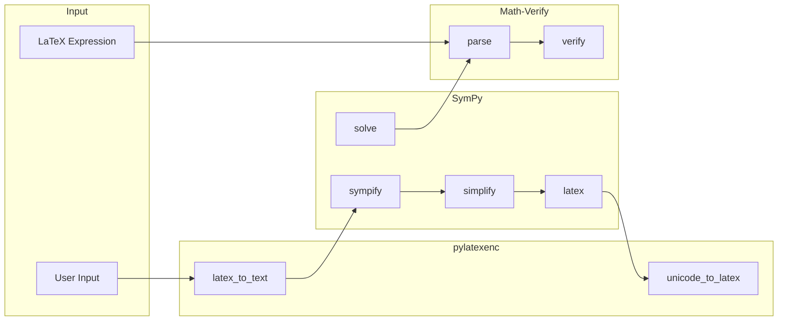

# Priority Libraries: Phase 1

The first three Python libraries for AutoBridge integration are selected for their stateless, computational nature and complementary functionality.

---

## Library Overview

| Library | Purpose | Size | Complexity |
|---------|---------|------|------------|
| **SymPy** | Symbolic mathematics | 847 functions | High (symbolic types) |
| **pylatexenc** | LaTeX ↔ Unicode | ~50 functions | Medium (string transforms) |
| **Math-Verify** | Expression evaluation | ~30 functions | Medium (parsing + verification) |

---

## 1. SymPy

### Overview

SymPy is a Python library for symbolic mathematics. It provides algebraic manipulation, calculus, equation solving, and more.

### Target Functions

**Core Symbolic Operations**:
```python
sympy.symbols(names)              # Create symbolic variables
sympy.solve(equation, variable)   # Solve equations
sympy.simplify(expr)              # Simplify expressions
sympy.expand(expr)                # Expand polynomials
sympy.factor(expr)                # Factor expressions
sympy.diff(expr, variable)        # Differentiate
sympy.integrate(expr, variable)   # Integrate
```

**Expression Manipulation**:
```python
sympy.Eq(lhs, rhs)                # Create equation
sympy.sympify(string)             # Parse string to expression
sympy.latex(expr)                 # Convert to LaTeX
sympy.N(expr, precision)          # Numerical evaluation
```

### Type Mapping Strategy

| Python Type | Elixir Type | Notes |
|-------------|-------------|-------|
| `sympy.Symbol` | `atom()` | Map symbol names to atoms |
| `sympy.Expr` | `String.t() \| map()` | Serialized expression |
| `sympy.Eq` | `{:eq, left, right}` | Tuple representation |
| `list[Expr]` | `[term()]` | List of solutions |
| `dict` | `map()` | Substitution maps |

### Challenges

1. **Symbolic expressions** - Complex nested structures need serialization strategy
2. **Assumptions** - SymPy has assumption system (`positive=True`, etc.)
3. **Large API** - Need to focus on core subset

### Integration Strategy

```elixir
# Focus mode for rapid convergence
AutoBridge.configure(:sympy, 
  focus: [
    :symbols, :solve, :simplify, :expand, :factor,
    :diff, :integrate, :Eq, :sympify, :latex, :N
  ],
  # Serialize expressions as strings by default
  expr_serialization: :string,
  # Timeout for complex computations
  timeout: 30_000
)
```

### Example Usage (Target)

```elixir
alias AutoBridge.SymPy

# Create symbols
{:ok, [x, y]} = SymPy.symbols("x y")

# Solve equation
{:ok, solutions} = SymPy.solve("x**2 - 4", :x)
# => [-2, 2]

# Simplify
{:ok, simplified} = SymPy.simplify("sin(x)**2 + cos(x)**2")
# => "1"

# Differentiate
{:ok, derivative} = SymPy.diff("x**3 + 2*x", :x)
# => "3*x**2 + 2"

# Convert to LaTeX
{:ok, latex} = SymPy.latex("x**2/2")
# => "\\frac{x^{2}}{2}"
```

---

## 2. pylatexenc

### Overview

pylatexenc provides bidirectional conversion between LaTeX and Unicode text.

### Target Functions

```python
# LaTeX to Unicode
pylatexenc.latex2text.LatexNodes2Text().latex_to_text(latex_str)

# Unicode to LaTeX
pylatexenc.latexencode.unicode_to_latex(unicode_str)

# LaTeX parsing
pylatexenc.latexwalker.LatexWalker(latex_str).get_latex_nodes()
```

### Type Mapping Strategy

| Python Type | Elixir Type | Notes |
|-------------|-------------|-------|
| `str` (LaTeX) | `String.t()` | LaTeX formatted |
| `str` (Unicode) | `String.t()` | Plain text |
| `LatexNode` | `map()` | AST node representation |
| `list[LatexNode]` | `[map()]` | Node list |

### Integration Strategy

Since pylatexenc is primarily stateless string transforms, it's ideal for AutoBridge:

```elixir
AutoBridge.configure(:pylatexenc,
  # Simple function wrapping, no class instances
  mode: :functions_only,
  # Core functions to wrap
  focus: [
    :latex_to_text,
    :unicode_to_latex,
    :get_latex_nodes
  ]
)
```

### Example Usage (Target)

```elixir
alias AutoBridge.PyLatexEnc

# LaTeX to plain text
{:ok, text} = PyLatexEnc.latex_to_text("\\textbf{Hello} $\\alpha + \\beta$")
# => "Hello α + β"

# Unicode to LaTeX
{:ok, latex} = PyLatexEnc.unicode_to_latex("α + β ≤ γ")
# => "\\alpha + \\beta \\leq \\gamma"

# Parse LaTeX to AST
{:ok, nodes} = PyLatexEnc.parse("\\frac{1}{2}")
# => [%{type: :macro, name: "frac", args: ["1", "2"]}]
```

---

## 3. Math-Verify

### Overview

Math-Verify is a mathematical expression evaluation system for assessing LLM outputs. It parses, normalizes, and compares mathematical expressions.

### Target Functions

```python
# Parse expressions
math_verify.parse(text, extraction_config=[...])

# Verify equality
math_verify.verify(gold, answer)

# Grading
math_verify.grader.grade(gold, answer)
```

### Type Mapping Strategy

| Python Type | Elixir Type | Notes |
|-------------|-------------|-------|
| `SymPy Expr` | `term()` | Parsed expression |
| `bool` | `boolean()` | Verification result |
| `ExtractionConfig` | `keyword()` | Config options |
| `ParseResult` | `{:ok, term()} \| {:error, term()}` | Parse result |

### Integration Strategy

```elixir
AutoBridge.configure(:math_verify,
  focus: [:parse, :verify, :grade],
  # Special handling for SymPy expressions
  inherit_types_from: :sympy,
  # Error handling for parse failures
  error_mapping: %{
    "ParseError" => :parse_error,
    "VerifyError" => :verify_error
  }
)
```

### Example Usage (Target)

```elixir
alias AutoBridge.MathVerify

# Parse LaTeX expression
{:ok, gold} = MathVerify.parse("${1,3} \\cup {2,4}$")
{:ok, answer} = MathVerify.parse("${1,2,3,4}$")

# Verify equivalence
{:ok, true} = MathVerify.verify(gold, answer)

# Parse with config
{:ok, expr} = MathVerify.parse("The answer is 42", 
  extraction: :expr,
  boxed_priority: 0
)
```

---

## Integration Pipeline



---

## Synergy Examples

### Complete Math Pipeline

```elixir
defmodule MyApp.MathPipeline do
  alias AutoBridge.{SymPy, PyLatexEnc, MathVerify}
  
  def evaluate_and_verify(problem_latex, student_answer) do
    # Parse LaTeX to text
    {:ok, problem_text} = PyLatexEnc.latex_to_text(problem_latex)
    
    # Solve symbolically
    {:ok, solution} = SymPy.solve(problem_text, :x)
    
    # Convert solution to LaTeX
    {:ok, solution_latex} = SymPy.latex(hd(solution))
    
    # Verify student answer
    {:ok, gold} = MathVerify.parse(solution_latex)
    {:ok, answer} = MathVerify.parse(student_answer)
    
    MathVerify.verify(gold, answer)
  end
end
```

### LLM Output Grading

```elixir
defmodule MyApp.LLMGrader do
  alias AutoBridge.MathVerify
  
  def grade_response(expected, llm_output) do
    with {:ok, gold} <- MathVerify.parse(expected, extraction: :latex),
         {:ok, answer} <- MathVerify.parse(llm_output, extraction: [:latex, :expr]),
         {:ok, true} <- MathVerify.verify(gold, answer) do
      :correct
    else
      {:ok, false} -> :incorrect
      {:error, reason} -> {:error, reason}
    end
  end
end
```

---

## Success Criteria

### Per Library

| Library | Finalization Criteria |
|---------|----------------------|
| SymPy | 10 core functions wrapped, type-safe, working solve/simplify |
| pylatexenc | All 3 core functions wrapped, bidirectional conversion working |
| Math-Verify | parse/verify working, integration with SymPy expressions |

### Overall

- All three libraries usable together in pipeline
- Zero manual configuration required after finalization
- < 5% overhead vs direct Python calls
- Comprehensive type specs for Dialyzer
